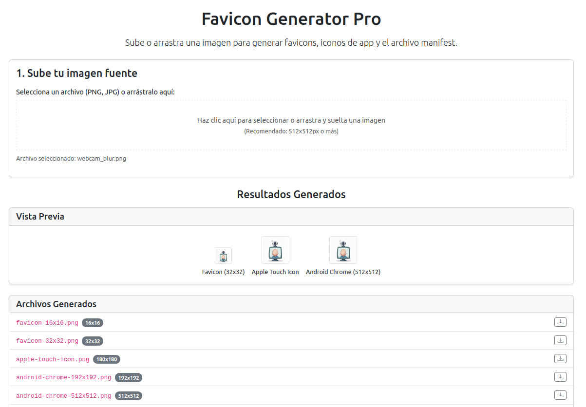

# ✨ Favicon Generator Pro

[](https://opensource.org/licenses/MIT) [](https://soyunomas.github.io/favicon-generator-pro/favicon_generator.html)

Una herramienta web client-side para generar favicons, iconos de app y el archivo `manifest.webmanifest` desde una única imagen, directamente en tu navegador. 🖼️

## 📝 Descripción Breve

Este proyecto proporciona una interfaz web sencilla, basada en Bootstrap, para crear un conjunto completo de favicons y archivos relacionados (incluyendo `favicon.ico` básico, varios PNGs para diferentes plataformas y un `manifest.webmanifest` básico) a partir de una única imagen fuente. Todo el procesamiento ocurre en el navegador del usuario (client-side), sin necesidad de subir la imagen a un servidor.

## 🖼️ Captura de Pantalla / Demo



Puedes probar la demo en vivo aquí:

*   **[Demo - Probar Generador](https://soyunomas.github.io/favicon-generator-pro/favicon_generator.html)**

## ✨ Características Principales

*   **⬆️ Carga Fácil:** Sube imágenes PNG o JPG mediante el selector de archivos o arrastrando y soltando (Drag & Drop).
*   **⚙️ Procesamiento Client-Side:** Redimensionamiento de imágenes y generación de formatos usando la API Canvas y JavaScript puro en el navegador.
*   **📦 Salida Completa:** Genera `favicon.ico` (32x32), PNGs (`16x16`, `32x32`, `180x180` para Apple Touch, `192x192`, `512x512` para Android/Manifest) y un archivo `manifest.webmanifest` básico.
*   **👁️ Vista Previa:** Muestra una previsualización de los iconos clave generados.
*   **📋 Lista de Archivos:** Detalla todos los archivos que se incluirán en la descarga, con sus dimensiones.
*   **💾 Descarga Flexible:**
    *   Descarga todos los archivos generados como un único paquete `.zip`.
    *   Descarga archivos individuales directamente desde la lista.
*   **✂️ Código HTML Listo:** Genera y permite copiar fácilmente el fragmento HTML `<head>` para incluir los iconos y el manifest en tu web.
*   **📱 Interfaz Moderna y Responsiva:** Diseño limpio utilizando Bootstrap 5, adaptable a diferentes dispositivos.
*   **🌗 Modo Claro/Oscuro:** Cambia fácilmente entre temas visuales claro y oscuro.
*   **🔗 Dependencias CDN:** Utiliza Bootstrap (CSS/JS) y JSZip desde CDNs para mantener el archivo HTML principal ligero.

## 🛠️ Tecnologías Utilizadas

*   **HTML5:** Estructura semántica del contenido.
*   **CSS3:** Estilos personalizados (tema claro/oscuro, layout específico).
*   **Bootstrap 5.3.x:** Framework CSS/JS para layout responsivo, componentes (tarjetas, botones, spinners) y utilidades.
*   **Bootstrap Icons:** Para iconografía (tema, copiar, descargar).
*   **JavaScript (ES6+):** Lógica de la aplicación, manipulación del DOM, gestión de eventos, procesamiento de imágenes.
*   **Web APIs:**
    *   **Canvas API:** Para redimensionar imágenes y generar datos de imagen.
    *   **File API:** Para leer el archivo subido por el usuario.
    *   **Blob API:** Para crear los archivos en memoria (PNG, ICO, Manifest, ZIP).
    *   **URL API (`URL.createObjectURL`, `URL.revokeObjectURL`):** Para previsualizar imágenes y crear enlaces de descarga.
    *   **Clipboard API (`navigator.clipboard`):** Para la funcionalidad de "Copiar Código".
*   **JSZip:** Librería para crear archivos `.zip` en el lado del cliente (cargada vía CDN).

## 🚀 Uso / Visualización Local

Este proyecto es una aplicación web estática que se ejecuta completamente en el navegador. Para usarla:

1.  **Clona el repositorio (Opcional, si quieres modificar):**
    ```bash
    git clone https://github.com/soyunomas/favicon-generator-pro.git
    ```
2.  **Navega al directorio del proyecto (si lo clonaste):**
    ```bash
    cd favicon-generator-pro
    ```
3.  **Abre el archivo HTML principal:**
    *   Abre el archivo `favicon_generator.html` directamente en tu navegador web preferido (Chrome, Firefox, Edge, etc.).
    *   O simplemente visita la **[Demo en vivo](https://soyunomas.github.io/favicon-generator-pro/favicon_generator.html)**.
4.  **🌐 Conexión a Internet Requerida:** Es necesaria para cargar Bootstrap (CSS y JS) y JSZip desde sus respectivos CDNs.
5.  **(Sin Instalación Adicional):** No se requiere software extra, servidores locales ni pasos de compilación.

## 🕹️ Cómo Funciona

1.  **Abrir:** Carga el archivo `favicon_generator.html` en tu navegador.
2.  **Subir Imagen:** Haz clic en el área de carga o arrastra y suelta un archivo de imagen (PNG o JPG) que servirá como base.
3.  **Procesamiento:** La aplicación redimensionará la imagen a los tamaños necesarios, generará el `.ico`, los `.png` y el `manifest.webmanifest` usando JavaScript en tu navegador. Verás un indicador de carga.
4.  **Resultados:** Una vez completado, se mostrarán:
    *   Vistas previas de los iconos principales.
    *   Una lista detallada de todos los archivos generados.
    *   El fragmento de código HTML para pegar en tu `<head>`.
5.  **Descargar:**
    *   Haz clic en "Descargar Paquete (.zip)" para obtener todos los archivos juntos.
    *   Haz clic en el icono de descarga <i class="bi bi-download"></i> junto a cada archivo en la lista para descargarlo individualmente.
6.  **Copiar Código:** Haz clic en el icono de copiar <i class="bi bi-clipboard"></i> junto al bloque de código HTML para copiarlo a tu portapapeles.
7.  **(Opcional) Cambiar Tema:** Usa el botón de sol/luna en la esquina superior derecha para alternar entre el tema claro y oscuro.

## 📄 Licencia

Este proyecto está bajo la Licencia MIT.
[](https://opensource.org/licenses/MIT)

## 🧑‍💻 Contacto

Creado por **soyunomas** ([@soyunomas en GitHub](https://github.com/soyunomas))

---
